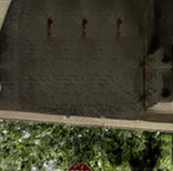

# Inconspicuous Naturalistic Adversarial Patches (INAPs) for Fooling Object Detectors
This project uses code from [this repository](https://github.com/zalandoresearch/famos.git) by Zolando Research.

This code base introduces a generative adversarial network (GAN) based approach to generating inconspicuous naturalistic adversarial patches (INAPs), which are intended to degrade the performance of object detection algorithms while remaining difficult to detect visually. This approach is separate from other work on traditional adversarial patches for several reasons. First, this project targets object detection model failure rather than classification. Secondly, this work focuses on adversarial patches that are placed in the background of a scene, rather than on top of the subjects in a scene. Additionally, the GAN architecture utilized for INAP creation in this work only requires a single image input for training.

Please refer to ["Learning Texture Manifolds with the Periodic Spatial GAN"](http://arxiv.org/abs/1811.09236) for an in-depth explanation of periodic spatial GANs and alternate use cases.

The code base has been tested on Ubuntu 18.04, PyTorch 1.12, and Python 3.9 utilizing NVIDIA Tesla V100-SXM2-32GB GPUs. It is recommended to have a GPU with 24GB or more for successful training.

## Applications
With this code, you can train a generative model on a single image to generate an inconspicuous adversarial patch for a selected location on the input image. 

### Example 1

| Original Image Detections| Attacked Image Detections |INAP |Result |
|--|--|--|--|
|  |  |  | 1 person hallucination of 64% |

### Example 2

| Original Image Detections| Attacked Image Detections |INAP |Result |
|--|--|--|--|
|  |  |  |3 person hallucinations of 93%, 93%, and 76% |

### Example 3

| Original Image Detections| Attacked Image Detections |INAP |Result |
|--|--|--|--|
|  |  |  | 1 person hallucination of 47%|

## Code Usage

### Install Dependencies
The base requirements to run the training script is listed in the requirements.txt file.

To install the CUDA compatible torch and torchvision modules, you can run the following command: 
`pip3 install torch==1.12.1+cu113 torchvision==0.13.1+cu113 -f https://download.pytorch.org/whl/cu113/torch_stable.html`

### Select the context
Select your context image. Some example images are provided in the `./content/` folder.

Select where you would like the patch to be on the context images, and record the coordinates of the area in the format: `[left, top, right, bottom]`. Please select patch coordinates that create a square with width and height a multiple of 32 (e.g. 96, 128, 160, ..., 288, 320, etc.).

### Train 
Update the config.py file to point the coordinates (`--coords`) and target image (`--contentPath`) arguments to the correct value.
Run `python train.py` in the command line. You may run the code on your desired GPU with the `--device` flag specified in the command line. 

For example: 
`python train.py --device=2`

Once you start training, you can track progress in the `results/` folder of the associated process.

Depending on the input size of the patch and image, your GAN may take between a few hours to a whole day to learn and may be too much data for a less powerful GPU. Be mindful of this when choosing your inputs. You can toggle the `--cropContentDisciminator` parameter in the config.py file to speed up training time. This setting crops the image being passed through the GAN to be only the surrounding area of the patch location.

## Parameters

There are many different parameters that can be tweaked for training the GAN. You can locate and change these in the config.py file. 

Some common parameters to experiment with include:
- Batch Size (`--batchSize`)
- Learning Rate (`--lr`)
- Number of Epochs (`--niter`)
- Alternative Loss Function (`--WGAN`, `--LS`)
- Adversarial Weight ( `--hp_od` )

Additionally, you may choose to switch on the printability parameter (`--printability`), which will compare the GAN generated patch pixel values to real world printer colors. You may utilize the provided color_palette.txt for this, or you may use your own.

## Authors and Acknowledgement
Special thanks to Mike Tan (ytan@mitre.org), Omid Aramoon(oaramoon@mitre.org), and Frank Chang (frank.chang1000@gmail.com) for their contributions to this work.

## Notice
Approved for Public Release; Distribution Unlimited. Public Release Case Number 23-3720
©2023 The MITRE Corporation. ALL RIGHTS RESERVED.

## License
This work is published under the apache-2.0 license. Please see [LICENSE](./LICENSE) for details.
